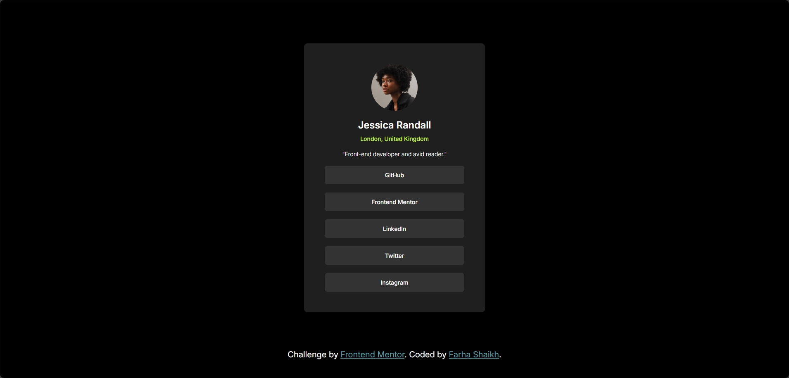

# Social-links

# Frontend Mentor - Social links profile solution

This is a solution to the [Social links profile challenge on Frontend Mentor](https://www.frontendmentor.io/challenges/social-links-profile-UG32l9m6dQ). Frontend Mentor challenges help you improve your coding skills by building realistic projects.

## Table of contents

- [Overview](#overview)
  - [The challenge](#the-challenge)
  - [Screenshot](#screenshot)
  - [Links](#links)
- [My process](#my-process)
  - [Built with](#built-with)
  - [What I learned](#what-i-learned)
- [Author](#author)

**Note: Delete this note and update the table of contents based on what sections you keep.**

## Overview

### The challenge

Users should be able to:

- See hover and focus states for all interactive elements on the page

### Screenshot

### Links

- Solution URL: [solution URL here](https://github.com/GraceRosario/Social-links)
- Live Site URL: [live site URL here](https://gracerosario.github.io/Social-links/)

## My process

### Built with

- Semantic HTML5 markup
- CSS custom properties
- Flexbox

### What I learned

i learnned that it is better to wrap heading under anchor tag instead of placing anchor tag inside heading tag. doing this will apply styles to whole anchor tag.

## Author

- Frontend Mentor - [@GraceRosario](#https://www.frontendmentor.io/profile/GraceRosario)
